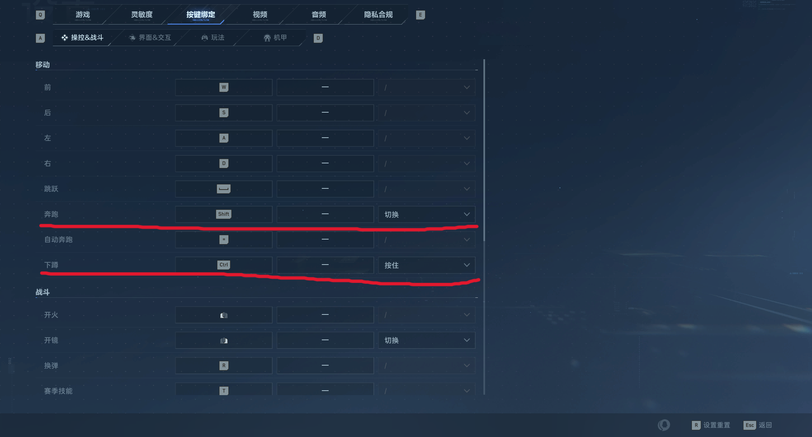

# **逆战未来刀喷脚本**

- 国内仓库下载地址：https://gitee.com/estonia/nzm.git
- GitHub仓库地址：https://github.com/estonia-sh/NZM.git

## 	 **使用说明：**

### **逆战刀喷.exe**

**介绍：**

- 该脚本通过鼠标侧键触发对应按键循环，适合任意鼠标使用。

**使用方法：**

- **下载并用管理员身份打开**
- 点击后侧键触发刀喷攻击循环（左键—右键—2—1），再次按下停止循环
- 点击前侧键触发技能F、V，放完技能后自动进入后侧键触发的攻击循环
- 在游戏中先点击后侧键进入刀喷攻击循环，在有技能时点击前侧键，自动释放技能然后再次进入攻击循环

### 刀喷v2.0.exe

**介绍：**

- 该脚本通过鼠标侧键触发对应按键循环，适合任意鼠标使用。
- 该脚本修改前侧键为滑铲跳

**使用方法：**

- **下载并用管理员身份打开**
- 点击后侧键触发刀喷攻击循环（左键—右键—2—1），再次按下停止循环
- 点击前侧键触发滑铲跳循环（ctrl—space—space）
- 在游戏中点击后侧键进入刀喷攻击循环，在需要快速移动时点击前侧键循环触发滑铲跳。

**注：**

- 需要修改设置中的按键绑定-奔跑为切换，下蹲为按住

- 使用前需要先按下shift键，以更改为奔跑模式，后续使用时确保为奔跑模式即可。
- 再次点击前侧键/或切换后侧键时会保持前进，若需要停止，按下W即可。
- 该脚本适用于任何鼠标，因前侧键绑定了滑铲跳，所以技能需手动按下。

### 刀喷v3.0.exe

**介绍：**

- 该脚本通过鼠标侧键触发对应按键循环，适合任意鼠标使用。
- 该脚本修改前侧键为滑铲跳加刀喷，在滑铲跳时加入刀喷循环。

**使用方法：**

- **下载并用管理员身份打开**
- 点击后侧键触发刀喷攻击循环（左键—右键—2—1），再次按下停止循环
- 点击前侧键触发滑铲跳+刀喷攻击循环。
- 其余注意事项参考刀喷v2.0.exe

### 逆战.exe

**介绍：**

- 该脚本为本人自用，适合罗技鼠标或者其他可编程鼠标使用。

**使用方法：**

- **下载并用管理员身份打开**
- 点击后侧键触发刀喷攻击循环（左键—右键—2—1），再次按下停止循环
- 点击前侧键触发技能F、V，放完技能后自动进入后侧键触发的攻击循环
- 在游戏中先点击后侧键进入刀喷攻击循环，在有技能时点击前侧键，自动释放技能然后再次进入攻击循环
- 点击F9触发射击，点击后会按住鼠标左键持续射击。（F9绑定在鼠标的滑轮左移）
- 点击F10触发滑铲跳（F10绑定在鼠标的滑轮右移）
- F9和F10可自定义绑定在鼠标的其他位置，**不可绑定在前后侧键**。

**注：**

- 建议绑定完F10和F9后使用板载模式，退出罗技程序，减少内存占用。
- 需要修改设置中的按键绑定-奔跑为切换，下蹲为按住

